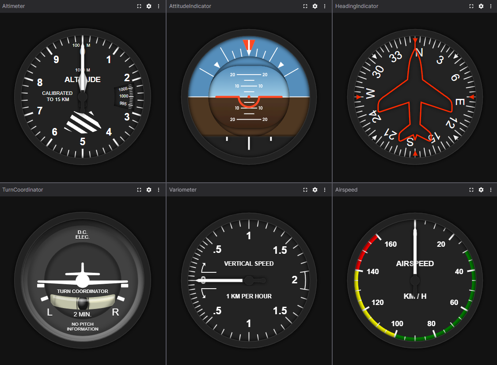

<div align="center">

# Foxglove Flight Indicators

**Six classic aviation instrument panels for [Foxglove Studio](https://foxglove.dev/)**

[](LICENSE)


<br/>



<br/>

*Altimeter · Attitude Indicator · Heading Indicator · Turn Coordinator · Variometer · Airspeed*

</div>

---

Monitor airspeed, altitude, attitude, heading, turn rate, and vertical speed on authentic glass-cockpit instruments — exactly as a pilot reads them. Built for UAVs, experimental aircraft, and flight simulation rigs where situational awareness during development and testing matters.

## Features

- **6 instrument panels** — the complete classic six-pack (airspeed, altimeter, attitude, heading, turn coordinator, variometer)
- **Universal message path inputs** — Foxglove's native autocomplete picks up any topic and field, including nested paths and array indices (`/sensors[0].airspeed`)
- **Any message type** — `std_msgs/Float64`, custom ROS types, or any schema that carries a number
- **Auto-sizing** — instruments fill the panel at any window size
- **MIT licensed** — rendering powered by [flight-indicators-js](https://github.com/teocci/js-module-flight-indicators) (MIT)

## Installation

**Linux / macOS**

```bash
git clone <repo>
cd foxglove-flight-indicators
npm install
npm run local-install    # builds and installs to ~/.foxglove-studio/extensions/
```

**Windows (from WSL)**

```bash
npm run win-install
```

**Distributable package**

```bash
npm run package          # produces zalandemeter.flight-indicators-x.x.x.foxe
```

Import the `.foxe` file via **Foxglove Studio → Extensions → Import**.

## Configuration

Each panel exposes **message path** fields in the settings panel (⚙ gear icon). A message path joins a topic name with a dot-separated field path:

```
/airspeed/speed.data            →  topic: /airspeed/speed,   field: data
/sensors.airspeed               →  topic: /sensors,          field: airspeed
/nav/sensors[0].ground_speed    →  topic: /nav/sensors,      field: [0].ground_speed
```

Foxglove Studio's autocomplete shows every available topic and field as you type.

---

## Panels

### Airspeed Indicator

| Setting | Unit | Range |
|---------|------|-------|
| Speed | KIAS | 0–160 (clamped) |

Displays indicated airspeed on a round dial. Values outside 0–160 KIAS are clamped at the scale limits.

---

### Altimeter

| Setting | Unit | Notes |
|---------|------|-------|
| Altitude | ft | Wraps every 1000 ft |
| Pressure | hPa | Kollsman window, clamped 870–1084 hPa |

Three-pointer drum-and-pointer altimeter with QNH setting. Standard ISA sea-level pressure: **1013.25 hPa** (29.92 inHg).

---

### Attitude Indicator

| Setting | Unit | Convention |
|---------|------|-----------|
| Pitch | ° | + = nose up |
| Roll | ° | + = right bank |

Gyroscopic horizon (ADI). No clamping is applied.

---

### Heading Indicator

| Setting | Unit | Notes |
|---------|------|-------|
| Heading | ° | Auto-normalized to [0°, 360°) |

Directional gyro (DG) compass rose. Values such as 400° or −90° are wrapped automatically.

---

### Turn Coordinator

| Setting | Unit | Range |
|---------|------|-------|
| Turn | ° | ±20° (clamped) |

Turn-and-bank needle. ±20° corresponds to a standard-rate turn (3°/s, 180° per minute). Input is needle deflection, not raw turn rate.

---

### Variometer

| Setting | Unit | Range |
|---------|------|-------|
| Vario | ft/min | ±1950 (clamped) |

Vertical speed indicator (VSI). Positive = climb, negative = descent.

---

## Development

```bash
npm install              # install dependencies
npm run build            # build only
npm run local-install    # build and install to Foxglove desktop
npm run win-install      # build and install to Foxglove on Windows (from WSL)
npm run package          # produce a .foxe file for distribution
```

See the [Foxglove extension documentation](https://docs.foxglove.dev/docs/visualization/extensions/introduction) for publishing to the public registry or a private organization.

---

## License

MIT © 2026 [Zalán Demeter](https://github.com/zalan-demeter)

SVG instrument graphics from [flight-indicators-js](https://github.com/teocci/js-module-flight-indicators) by Teocci — MIT.
